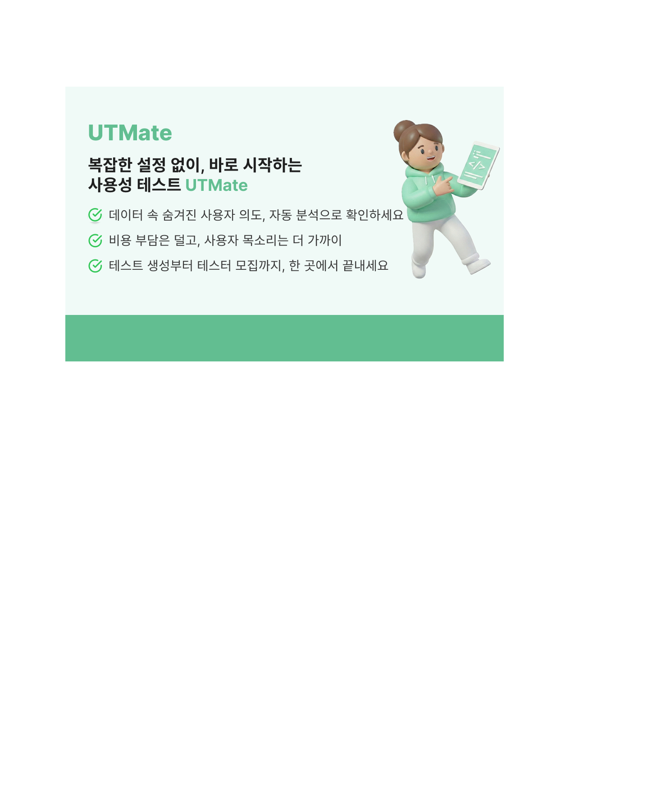
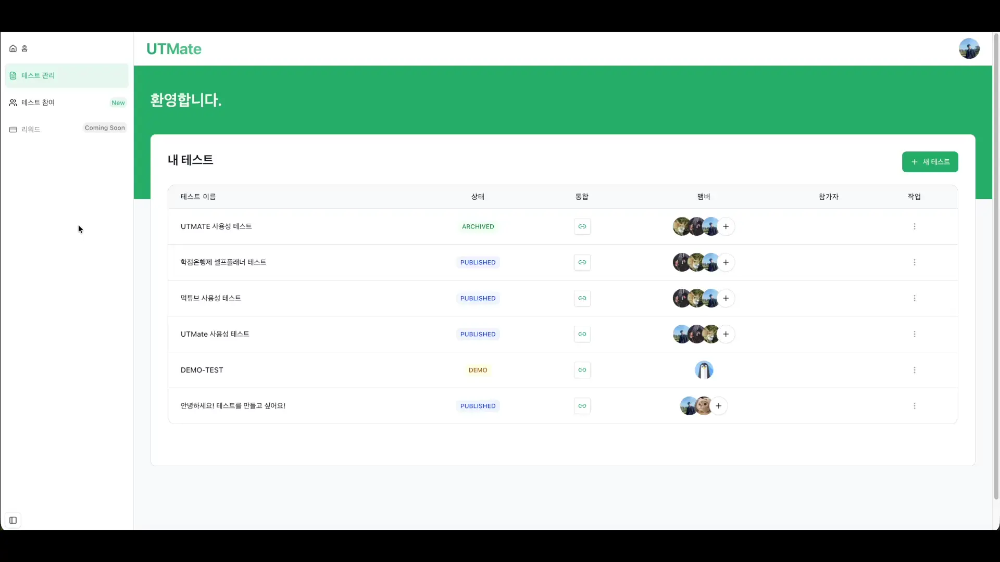

<div align="center">

# 🍪 UTMate

> **Boostcamp Web·Mobile 10기 | 그룹 프로젝트**

### 사용성 테스트 플랫폼



[🏠 Wiki 홈](https://github.com/boostcampwm2025/web16-UTMate/wiki) | [📄 프로젝트 기획서](https://github.com/boostcampwm2025/web16-UTMate/wiki/%ED%94%84%EB%A1%9C%EC%A0%9D%ED%8A%B8-%EA%B8%B0%ED%9A%8D%EC%84%9C) | [💻 기술 스택](https://github.com/boostcampwm2025/web16-UTMate/wiki#%EA%B8%B0%EC%88%A0%EC%8A%A4%ED%83%9D)

</div>

---

<table>
  <tr>
    <td width="50%" align="center">
      
      <b>🔍 공개 테스트 탐색</b>
    </td>
    <td width="50%" align="center">
      
      <b>✨ 테스트 생성</b>
    </td>
  </tr>
  <tr>
    <td width="50%" align="center">
      
      <b>🎯 테스트 참여</b>
    </td>
    <td width="50%" align="center">
      
      <b>📊 세션 리플레이</b>
    </td>
  </tr>
</table>

<br>

<div align="center">

## 🎬 서비스 시연 영상

[](https://youtu.be/rsLvzE2CpJw)

**👆 클릭하여 전체 영상 보기 (YouTube)**

</div>

---

## 📌 UTMate 서비스 소개

<div align="center">

### 🍪 UTMate
**세상에서 제일 쉬운 사용성 테스트 플랫폼**

<br>

</div>

### ✨ 주요 기능

<table>
  <tr>
    <td width="50px" align="center">🎨</td>
    <td>
      <b>간편한 테스트 생성</b><br>
      단계별 설정을 통해 사용성 테스트를 간단하게 생성할 수 있어요
    </td>
  </tr>
  <tr>
    <td width="50px" align="center">🔗</td>
    <td>
      <b>손쉬운 공유</b><br>
      사용성 테스트를 생성하고 링크를 공유하기만 하세요
    </td>
  </tr>
  <tr>
    <td width="50px" align="center">📊</td>
    <td>
      <b>정량적 분석</b><br>
      세션 리플레이, 로그 분석을 통해 사용성을 정량적으로 검증할 수 있어요
    </td>
  </tr>
  <tr>
    <td width="50px" align="center">👥</td>
    <td>
      <b>테스터 모집</b><br>
      테스터 모집 고민은 끝! 공개 테스트로 설정하면 더 많은 테스터를 모집할 수 있어요
    </td>
  </tr>
</table>

---

## 🛠️ 기술 스택

<table>
    <thead>
        <tr>
            <th>Category</th>
            <th>Stack</th>
        </tr>
    </thead>
    <tbody>
        <tr>
            <td>
                <p align=center>Common</p>
            </td>
            <td>
                
                
                
                
                
            </td>
        </tr>
        <tr>
            <td>
               <p align=center>Frontend</p>
            </td>
            <td>
                
                
                
                
                
                
                
                
                
            </td>
        </tr>
        <tr>
            <td>
                <p align=center>Backend</p>
            </td>
            <td>
                
                
                
                
                
                
                
                
            </td>
        </tr>
        <tr>
            <td>
                <p align=center>SDK</p>
            </td>
            <td>
                
                
            </td>
        </tr>
        <tr>
            <td>
                <p align=center>Infrastructure & Deployment</p>
            </td>
            <td>
                
                
                
                
                
            </td>
        </tr>
        <tr>
            <td>
                <p align=center>Monitoring</p>
            </td>
            <td>
                
                
            </td>
        </tr>
    </tbody>
</table>

자세한 기술 스택 정보는 [기술 스택 문서](https://github.com/boostcampwm2025/web16-UTMate/wiki/TechStack-Overview)를 참고해주세요.

## 서비스 3요소


## 서비스 아키텍쳐


## CI/CD


---

## 🚀 시작하기

### 필수 요구사항

- Node.js 18.x 이상
- npm 또는 yarn
- Docker (선택사항)

### 설치 및 실행

#### pnpm 설치를 먼저 해주세요!

```bash
# 저장소 클론
git clone https://github.com/your-org/web16-boostcamp.git
cd web16-boostcamp

# 의존성 설치
pnpm install

# 개발 서버 실행
pnpm dev
```

---

## 👥 팀 소개

| 이름   | GitHub                                         | 아이디 |
| ------ | ---------------------------------------------- | ------ |
| 김재민 | [@jammin94](https://github.com/jammin94)       | J064   |
| 김지원 | [@Kjiw0n](https://github.com/Kjiw0n)           | J072   |
| 이용우 | [@RyuRain0309](https://github.com/RyuRain0309) | J201   |
| 채문성 | [@chaesunbak](https://github.com/chaesunbak)   | J267   |

---


<div align="center">

**Made with ❤️ by 노잼쿠키 팀**

[Wiki](https://github.com/boostcampwm2025/web16-UTMate/wiki/Home) · [Issues](https://github.com/boostcampwm2025/web16-UTMate/issues) · [Pull Requests](https://github.com/boostcampwm2025/web16-UTMate/pulls)

</div>
